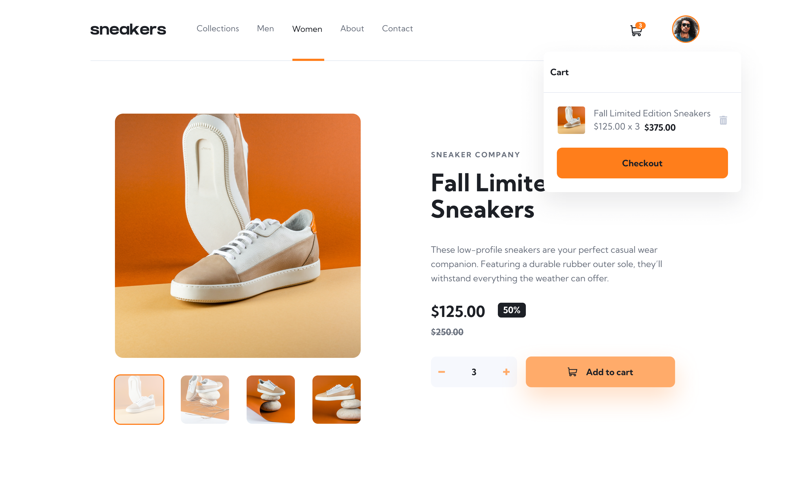

# React + Vite Project

## E-commerce product page

This project is a simple E-commerce Product Page built with modern frontend tools. It demonstrates how to display products, manage a shopping cart, and create a responsive UI that works seamlessly across desktop and mobile devices. Every part of this project is sample code which shows how to do the following:

* Open a lightbox gallery by clicking on the large product image
* Switch the large product image by clicking on the small thumbnail images
* Add items to the cart
* View the cart and remove items from it
* View the optimal layout for the site depending on their device's screen size
* See hover states for all interactive elements on the page

## 📸 Screenshots

### Main Interface

### 🚀 How to install the project and run it
1. Clone the repository
2. Navigate to the project folder - cd your-repo-name
3. Install dependencies - npm install
4. Start the development server - npm run dev 

## 🔗 Links
- Solution URL (GitHub Repository): [Link](https://github.com/abdizahir/E-commerce-product-page.git)  
- Live Site URL (Deployed App): [Link](https://e-commerce-product-page-one-rho.vercel.app/)

## 🛠️ Built With
- React – JS library
- Vite
- HTML5 & CSS3
- Tailwind
- JavaScript (ES6+)

## Author
**Abdallah Mohammed**  
- GitHub: [github.com/your-username](https://github.com/abdizahir)   